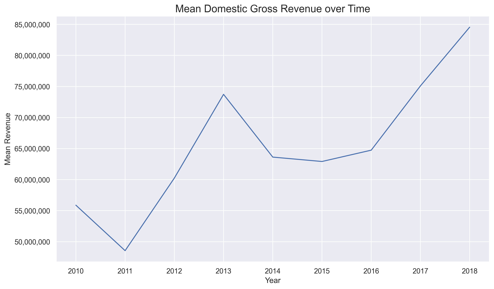
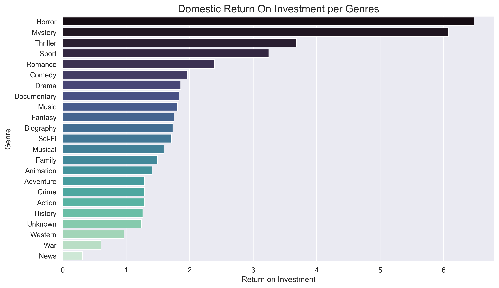
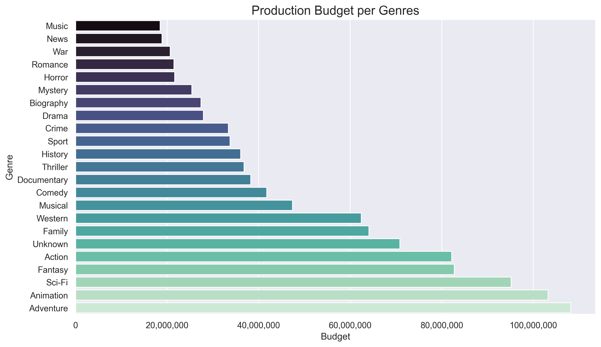
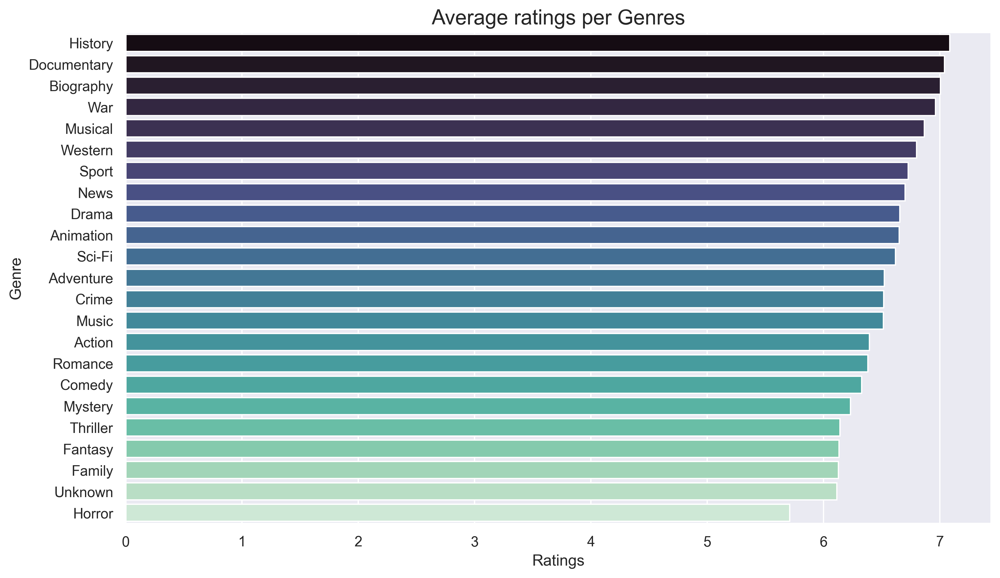

# Project Title: Data-Driven Movie Studio Profitability Analysis

# ****Author: GROUP 7****

## **1.0 Business Understanding**

### **1.1 Overview**
The entertainment industry is highly competitive, with film studios facing significant financial risks due to high production costs and unpredictable audience preferences. For a new movie studio entering the market, data-driven decision-making is critical to maximize profitability, minimize risks, and establish a sustainable business model. This project aims to analyze historical film performance data to identify key success factors, optimize production strategies, and recommend actionable insights for the studio’s initial film slate.

### **1.2 Challenges**

Key challenges include:

- Understanding overall performance of the film industry overtime.
- Identifying which genres and film types that yield the highest returns
- Determining optimal budget ranges for different categories of films
- Understanding how reviews correlate with film success
- Understanding the relationship between production factors and financial success

### **1.3 Proposed Solution**

Analyze historical box office data to identify information and patterns like genres, budgets, reviews, franchises in successful films. Then provide actionable recommendations to guide the company on the things to prioritize and the studio content strategy to adopt.

### **1.4 Conclusion**

By leveraging data analysis, the company can identify successful and failure patterns inorder to adopt the right strategy, mitigate risks and align its film production with market demand.

### **1.4 Problem Statement**

The company aims to establish a new movie studio to capitalize on the growing demand for original video content. However, due to lack of experience in movie production, they need data-driven insights to make strategic decisions about film production that will maximize profitability in a competitive entertainment market. 

### **1.6 Objectives**

1. To analyze historical box office data to identify trends over the years
2. To explore any linear relationship between production budget and revenue
3. To analyze audience review
4. To provide actionable recommendations on best film production strategies

## **2.0 Data Understanding**

### **2.1 Data Sources**
The folder zippedData contains historical box office data scrapped from https://www.boxofficemojo.com/, https://www.imdb.com/, https://www.rottentomatoes.com/, https://www.themoviedb.org/, https://www.the-numbers.com/ that will be used for this analysis, detailing all relevant information about film industry, including the movie genres, their budget, revenue, producers, release date and reviews. For this project we will concentrate on the following:

| Source | Description |
|--------|-------------|
| Box Office Mojo | Historical box office performance |
| The Numbers | Production budgets and financials |
| IMDb | Movie basics and Movie ratings table |

### **2.2 column description**
Relevant columns:

1. **genres**
- Type: Categorical
- Description: The primary category/categories of the film (e.g., Action, Comedy, Drama, Animation).

2. **production_budget**
- Type: Numerical
- Description: Total production cost of the film in USD.

3. **domestic_gross/worldwide_gross**
- Type: Numerical
- Description: Total box office earnings in USD.

4. **release_date**
- Type: Categorical
- Description: Month the film was released

5. **runtime_minutes**
- Type: Numerical
- Description: Duration of the film in minutes.

6. **averagerating**
- Type: Numerical
- Description: Audience or critic aggregate score

7. **num_votes**
- Type: Numerical
- Description: The number of votes per genre rating

## 3.0 Data Preparation

### 3.1 Method of Analyis

1. Data cleaning
2. Descriptive statistics
3. Visualization
4. Dashboard: https://public.tableau.com/views/MOVIESTUDIOSTRATEGYDEVELOPMENT/Dashboard1?:language=en-US&publish=yes&:sid=&:redirect=auth&:display_count=n&:origin=viz_share_link

### 3.2 Key Questions to Answer

1. How is the historical box office trend?
2. What is the relationship between production budget and revenue?
3. Which genres had the best ROI?
4. How does review correlate with film performance?
5. What can we learn from recent box office successes and failures?

### 3.3 Expected Deliverables

1. **Historical box office performance trend**: Analyze film performance over the years
   
   
   
3. **Production Budget-Revenue**: Establish relationship between budget and 
4. **Genre-ROI relationship**: Analyze financial performance by genre
   
   
   
6. **Genre-Budget ranges**: Analyze genres average budget ranges
   
   
   
8. **Genre ratings**: Analyze financial performance by genre
   
   
   
## 4.0 Project Structure

1. data folder-cleaned data file movie.csv
2. images-images of plots
3. zippedData-scrapped data from sources
4. README.md-summary
5. Notebook - index.ipynb

## 5.0 How to Contribute

1. Clone the repository
2. Create a new branch for your work
3. Submit pull requests for review
4. Document all findings in the reports folder
5. Maintain clean, commented code

